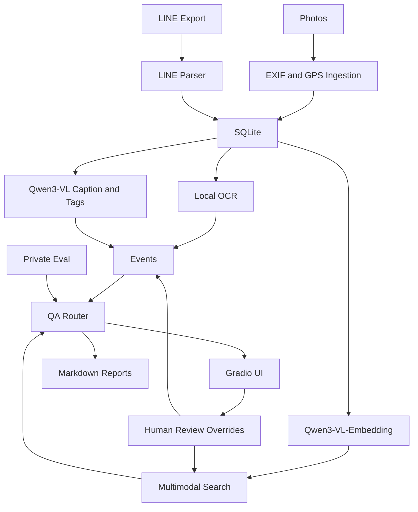

# System Architecture

## Overview

The system is a local multimodal RAG pipeline. It ingests private data into a
SQLite database, adds local OCR/VLM/embedding analysis, builds evidence-linked
events, and exposes QA/search/review workflows through CLI and Gradio UI.

## Data Ingestion

Photo ingestion extracts file metadata, timestamps, camera metadata, thumbnails,
and GPS presence. LINE ingestion parses exported messages and builds structured
message rows. Call index extraction converts call-like messages into structured
call events.

## SQLite Tables

Key tables:

- `media_items`: imported photo metadata and thumbnail references
- `line_messages`: parsed chat messages
- `line_call_events`: structured call records
- `media_ocr`: local OCR results
- `media_vlm`: local VLM captions, tags, cues, safety flags
- `media_embeddings`: local image and text embeddings
- `events`: generated memory events
- `event_evidence`: links events to LINE, photo, OCR, and VLM evidence
- `event_overrides`: human corrections for events
- `media_vlm_overrides`: human review state for VLM outputs
- `analysis_jobs`: resumable analysis job metadata

## OCR

OCR is optional and local. OCR text is treated as evidence, but not as a
guaranteed fact. Display code redacts email, phone-like strings, long numbers,
and other sensitive tokens.

## VLM

Qwen3-VL runs locally and produces cautious structured JSON:

- caption
- short caption
- scene tags
- object tags
- activity tags
- food cues
- location cues
- people count when visually obvious
- safety flags

Safety filters remove or flag relationship, identity, emotion, and sensitive
attribute inference.

## Embedding

Qwen3-VL-Embedding runs locally to build:

- image embeddings
- OCR/caption/combined-text embeddings
- query embeddings

Embedding-only results are candidate evidence, not conclusive answers.

## Event Generation

Events combine LINE, photos, GPS presence, OCR, and VLM cues. VLM-only evidence
is weak; confidence is raised only when multiple evidence types agree. Human
overrides for hidden, pinned, verified, title, summary, tags, and location are
preserved.

## Search and QA

The query router classifies natural-language questions into intents such as:

- date QA
- place visit
- food activity
- call activity
- photo or multimodal image search
- monthly summary

Hybrid search reranks candidates using:

- embedding similarity
- VLM text/tag match
- OCR match
- LINE match
- event match
- place match
- review/override boost or penalties

## UI

The Gradio UI is localhost-only. It supports:

- monthly summaries
- multimodal search
- result detail review
- event review
- VLM review
- report viewing
- local analysis tools

## Private Eval and Reports

Private eval checks intent routing, date QA, image search, VLM quality, event
quality, and safety constraints. Reports summarize architecture, statistics,
evaluation, and limitations in public or private mode.

